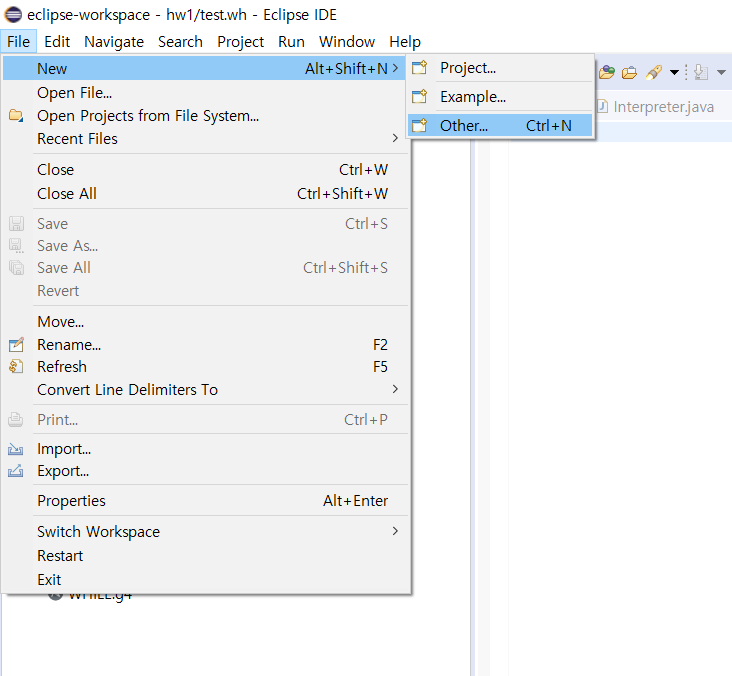
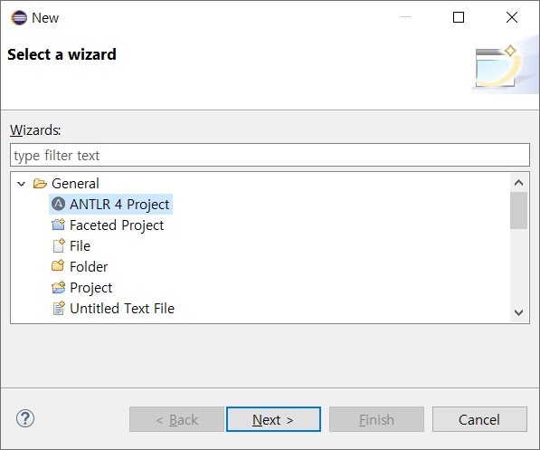
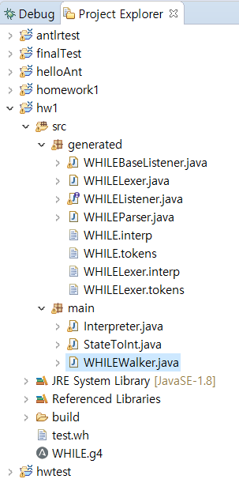
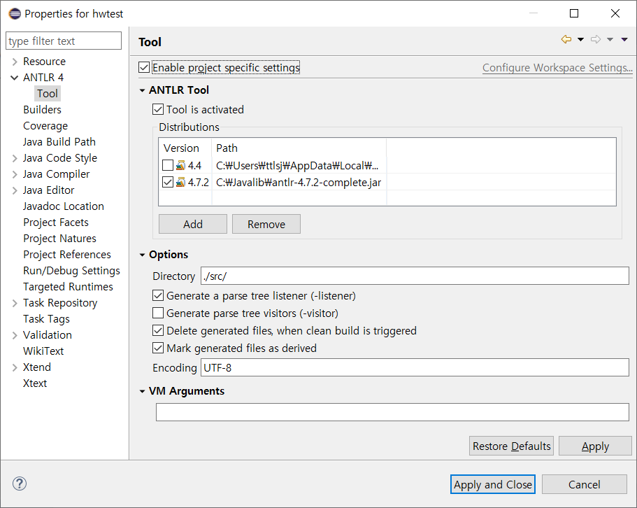
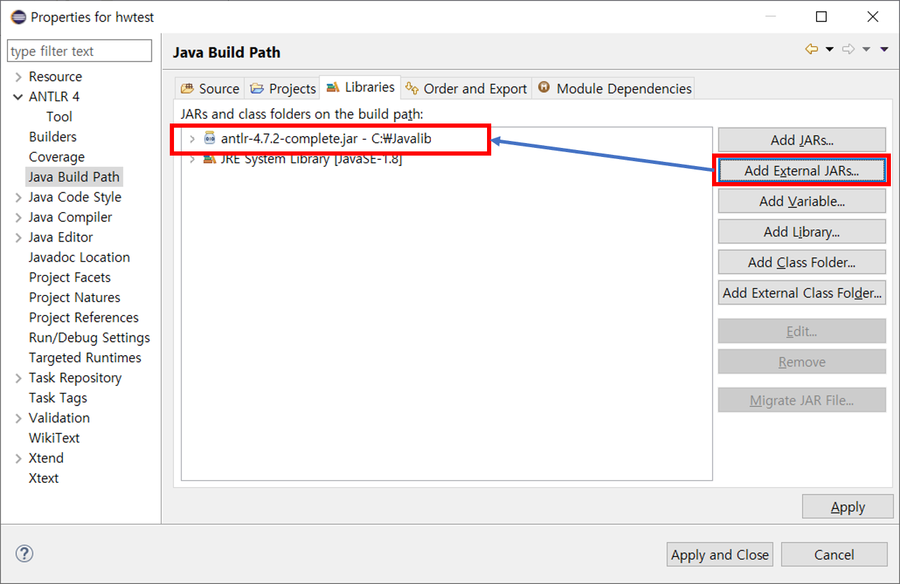
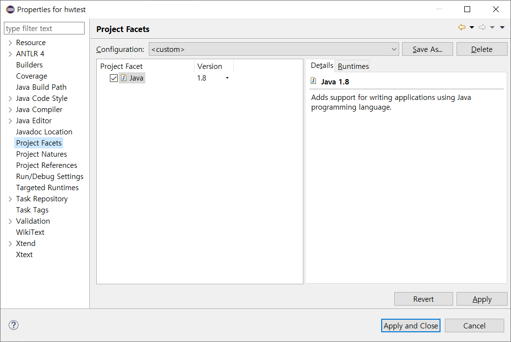
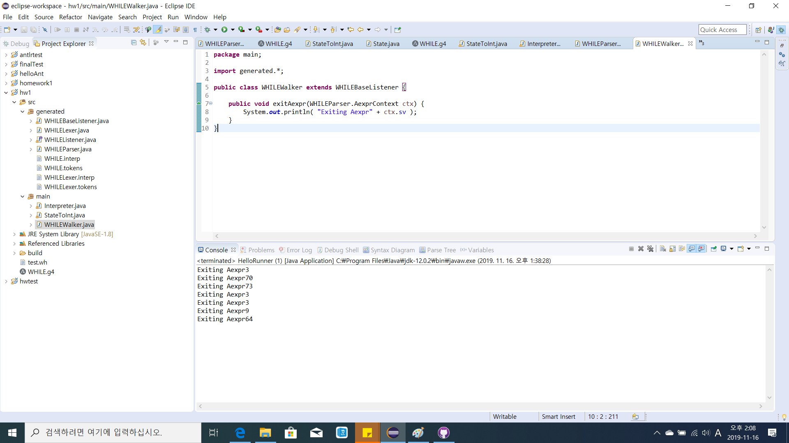
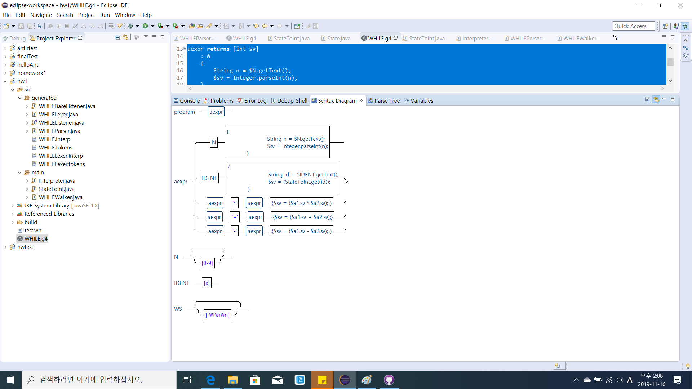

# ANTLR4를 이용한 간단한 계산기 예제

먼저, ANTLR4를 설치해야한다.
아래 링크를 참고하여 eclipse기반의 ANTLR4 환경을 설치한다.

[Eclipse 설치(ANTLR4 IDE)](https://github.com/jknack/antlr4ide)

[ANTLR4 설치(JAR)](https://github.com/antlr/antlr4/blob/master/doc/getting-started.md)

Eclipse 및 ANTLR4 설치가 완료되었으면,
아래 그림과 같이 ANTLR4 프로젝트를 생성한다.

프로젝트 생성을 완료하였다면,
소스코드를 download한 후, 아래 그림과 동일하게 파일구성이 되도록 download한 파일들을 복사 및 붙여넣기한다.

프로젝트가 정상적으로 컴파일 및 동작하려면,
추가로 프로젝트 환경설정을 해주어야 한다.
아래 그림을 참고하여 프로젝트 환경설정을 해준다.

소스코드를 실행하면 아래 그림과 같이 ANTLR예제가 정상적으로 실행되는 것을 확인할 수 있다.

다음은 WHILE.g4에 대한 Syntax Diagram 화면이다.

