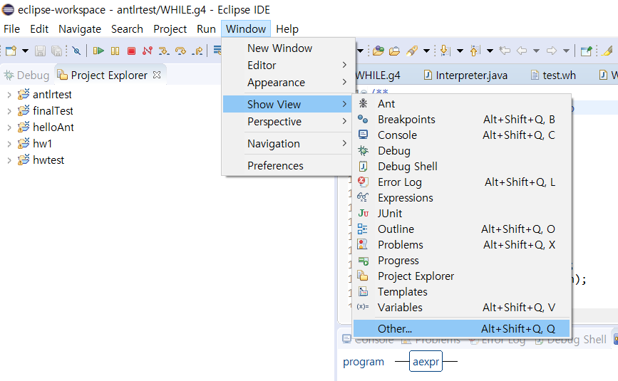

# ANTLR4를 이용한 간단한 계산기 예제

## 1. Eclipse 및 ANTLRL4 설치 
ANTLR4를 이용한 코드작성을 하려면 개발환경이 필요하다.
ANTLR4를 지원하는 언어 및 개발환경은 C#, python 등 여러가지가 있는데,
본 예제에서는 JAVA 기반의 환경을 활용하였다.
JAVA 및 ANTLR4를 활용하기 위한 환경설치를 위하여 아래 링크를 참고하였다.

[Eclipse 설치(ANTLR4 IDE)](https://github.com/jknack/antlr4ide)

[최신 ANTLR4 설치(JAR)](https://github.com/antlr/antlr4/blob/master/doc/getting-started.md)

## 2. ANTLR4 컴파일 및 실행환경 설정
프로젝트가 정상적으로 컴파일 및 동작하려면,
추가로 몇가지 프로젝트 환경설정을 해주어야 한다.
아래 그림을 참고하여 프로젝트 환경설정을 해준다.

## 3. ANTLR4 프로젝트 새로 생성
Eclipse 및 ANTLR4 설치 후, 아래 그림과 같이 새로운 ANTLR4 프로젝트를 생성한다.

## 4. 계산기 예제 프로젝트 구현
github repository에 올려둔 소스코드의 "WHILE.g4" 와 같이 코드를 작성하여 컴파일하면,
아래의 그림처럼 "src" 하위로 "generated" 폴더가 생성되면서 자동으로 JAVA파일들이 생성된다.
이때, 앞서 언급한 "2. ANTLR4 컴파일 및 실행환경 설정"에서 ANTLR4>TOOL 의 경로설정이 "./src/" 로 되어있어야 설명처럼 동작한다.

예제의 WHILE.g4는 전역 MAP을 활용하기 위해서 Interpreter.java를 import하도록 구현되었다.
따라서, 아래 그림처럼 "src/hw1" 하위로 Interpreter.java를 추가해 주어야 WHILE.g4가 정상적으로 컴파일된다.
Interpreter.java는 또한 main함수를 포함하고 있다.

마지막으로 계산기 예제코드의 연산결과를 출력하기위하여,
WHILEWalker.java를 구현하였다.

## 5. 계산기 예제 동작 화면
모든 설정이 정상적으로 완료되었다면,
아래 그림과 같이 ANTLR예제가 정상적으로 실행되는 것을 확인할 수 있다.

다음은 WHILE.g4에 대한 Syntax Diagram 화면이다.

Eclipse에서 Syntax diagram창을 보려면 아래와 같이 설정해야한다.

