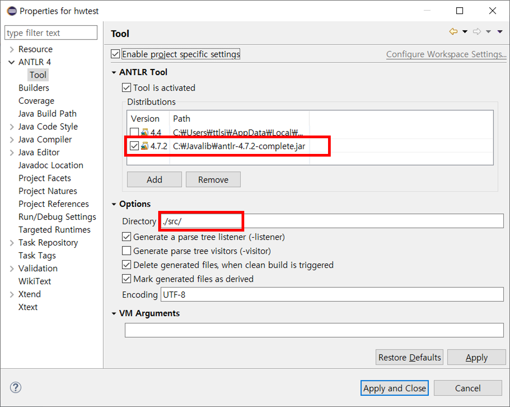

# ANTLR4를 이용한 간단한 계산기 예제

## 1. Eclipse 및 ANTLRL4 설치 
ANTLR4를 이용한 코드작성을 하려면 개발환경이 필요하다.
ANTLR4를 지원하는 언어 및 개발환경은 C#, python 등 여러가지가 있는데,
본 예제에서는 JAVA 기반의 환경을 활용하였다.
아래 링크를 참고하여 JAVA 및 ANTLR4를 활용하기 위한 환경을 설치한다.

[Eclipse 설치(ANTLR4 IDE)](https://github.com/jknack/antlr4ide)

[최신 ANTLR4 설치(JAR)](https://github.com/antlr/antlr4/blob/master/doc/getting-started.md)

## 2. ANTLR4 프로젝트 새로 생성
Eclipse 및 ANTLR4 설치가 완료되었으면,
아래 그림과 같이 ANTLR4 프로젝트를 생성한다.

## 3. 계산기 예제 프로젝트 구성
ANTLR4 프로젝트 생성을 완료하였다면,
github repository를 통해서 소스코드를 download하여 압축을 푼다.

[hw1] 폴더 하위에 있는 파일들을 복사 및 붙여넣기하는 방식으로,
아래 그림과 동일하게 파일구성을 완료한다.

물론, 기존 JAVA 파일을 이용하여 프로젝트 생성 기능을 활용해도 무방하지만,
그렇게 프로젝트를 생성할 경우 프로젝트 설정창에서 ANTLR4 설정 탭이 활성화되지 않는 문제가 있었다.
G4 확장자 파일(ANTLR)의 컴파일도 잘되고 프로그램 동작상의 문제점은 없지만,
공부하는 의미에서 아래의 예제처럼 ANTLR4 프로젝트를 생성하여 설정해 볼 것을 추천한다. 

## 4. ANTLR4 컴파일 및 실행환경 설정
프로젝트가 정상적으로 컴파일 및 동작하려면,
추가로 몇가지 프로젝트 환경설정을 해주어야 한다.
아래 그림을 참고하여 프로젝트 환경설정을 해준다.

## 5. 계산기 예제 동작 화면
모든 설정이 정상적으로 완료되었다면,
아래 그림과 같이 ANTLR예제가 정상적으로 실행되는 것을 확인할 수 있다.

다음은 WHILE.g4에 대한 Syntax Diagram 화면이다.

